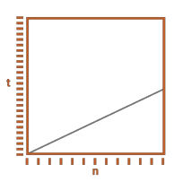
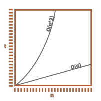

# Run Time Complexity and Bit O Notation

In this article, I will be covering time complexity and big O notation. Check out the video version of this article on [YouTube](https://youtu.be/h7SEzwJR97o).

So what exactly is time complexity? Fundamental, time complexity describe how an algorithm scales. And that is it. But what exactly does that mean? Let’s look at a simple example, written in JavaScript.

```javascript
function count(n) {
    for (let i=1; i<=n; ++i) {
        console.log(i);
    }
}
```

All this function does is print out the numbers from 1 to n inclusively. If we were to execute this function with some value of n, it would take t time. If we doubled the value of n, how much more time would it take? It would take twice as long.



Think of it as the amount of additional work that has to be preformed as the data-set increases. When we double the value of n, we double the number of iterations within the for loop. Twice as much work, will require twice as much time.

If we were to triple the value of n, it would take three times as long. We can plot this out on a graph, where n is on the X axis and time is on the Y axis, and it would look like this.

This is called liner time complexity, and is represented as O(n) in Big O notation. What it essentially means is that as n increase, the time required, increases linearly. To be clear though, Big O does not tell us if one function is faster than another, all it does is tell us how an algorithm scales or the rate of increase.

We’ve seen an example of liner time complexity, but there are a lot of different run times to be aware of. The following are the most common, but there is no fixed list.


- Constant O(1)
- Logarithmic O(log n)
- Linear O(n)
- Linear Logarithmic O(n log n)
- Quadratic O(n^2)
- Cubic O(n^3)
- Exponential O(k^n)
- Factorial O(n!)

Run times can be combined, for example linear logarithmic O(n log n), and you can have multiply variables within a runtime.  For example, O(nm). N is a commonly used variable, but you can use any variable you want, O(i).

## Constant time complexity

Constant time complexity is represented as O(1), and what it means is that an algorithm will take the same amount of time to execute, regardless of the size of the data set.

Here’s a simple example.

```javascript
function pring(n) {
	console.log(n);
}
```

With this function, it doesn’t matter if we increase or decrease the value of n. It will always take the same amount of time to execute. To be clear, we don’t know how much time this function will require to execute, all we know is that it won’t change if we were to increase the data set. You might assume that a constant time algorithm, would execute very quickly, or nearly instantly. And most of the time, this is accurate, but not always. Let’s look at another example.

What is the runtime of this function?

```javascript
function printTwo(n) {
	let result=0;
	for (let i=0; i<1000000; ++i){
		result += n;
	}
	console.log("result: " + result);	
}
```

- [ ] O(n)
- [ ] O(1000000)
- [ ] O(1)
- [ ] O(1000000n)

The parameter n, has no effect on the loop, so we have to preform the same amount of work, every time this function is executed, regardless of the value of n. So it’s O(1).

You may be wondering if O(1000000) would be a more accurate answer. Let’s take a look at another example, to help clarify this question. Keep in mind, all we are trying to do, is describe how an algorithm scales.


```javascript
function countTwice(n) {
	for (let i=1; i<=n;++i) {
	 	console.log(i);
	}
	for (let i=1; i<=n;++i) {
	 	console.log(i);
	}
}
```

All I’ve done, is take the function count, and add a second loop within it. So what is the time complexity of this function now?
- [ ] O(n)
- [ ] O(2n)
- [ ] O(n^2)

We can clearly see that we have to iterate through n twice, so it should be O(2n), right?

For any value of n, this function will take t time. If we were to double the value of n, how much more time would it require? It would require twice as much time as in the base case. Think of it as the amount of additional work we have to do in relation to the data set. In the base case, we have to iterate through n twice, because we have 2 for loop. So that would be 2n work. When we double the value of n, each for loop has to do 2n work, for a total of 4n work, which is twice as much work as in the base case.  This is why we drop constant values from the runtime. O(2n) becomes O(n), O(100000) becomes O(1).

Time complexity does not tell us which algorithm will execute faster, all it does is tell us how an algorithm scales, or the rate of increase as related to the data set. As the data set increase, how much more time, will this algorithm require to execute.

To help hammer this point home, lets take a look at another example.

```javascript
function d(n) {
	for (let i=0; i<n; ++i) {
		// do something //
		// do something else //
		// do the final step //
	}
}
```
For this example, we’ll just assume that each step runs in constant time. With that said, this function has a linear time complexity or O(n). But what if we were to split each step up, into its own loop. Like this.

```javascript
function d(n) {
    for (let i=0; i<n; ++i) {
        // do something //
    }
    for (let i=0; i<n; ++i) {
        // do something else //
    }
    for (let i=0; i<n; ++i) {
        // do the final step //
    }
}
```
Now, what would the time complexity be for this function? It would still be linear, or O(n). It doesn’t matter that I split up each step into its own loop, and here is another example of the exact same thing.

```javascript
function f(n) {
    return n.filter(/*  */)
        .map(/* transform Object */)
        .reduce(/* reduce to result */);
}
```

All I’ve done is exchanged the for loops with array functions. In case you were wondering, this still runs in linear time complexity, considering the limited code within the example.

Let's take a look at another example.
```javascript
function f(n) {
	for (let i=0; i<n/2; ++i) {
		// do something
	}
}
```
What is the time complexity of this function?
- [ ] O(n/2)
- [ ] O(n)
- [ ] O(n^2)

<details>
<summary>Click to expand solution</summary>

In this function we have n/2 iteration within the for loop. But just like in the case where we had 2n iteration, the constant value 2, doesn’t provide any meaningful information, so drop it, to get the answer of O(n). But don’t take my word for it, verify it for yourself. For any value of n, this function will take t time. How much time would it take, if we double the value of n?

</details>


Before we move on, try to remember run time complexity does not tell us which algorithm will run faster, all it does is tell us the rate of growth. A linear algorithm may run faster than a constant algorithm for a specific data set of n. The only thing time complexity tells us, is that as the data set increases, the linear algorithm, will require more time to execute, whereas the constant time algorithm won’t be affected.

What’s the time complexity of this function?
```javascript
function g(n) {
	for (let x=0; x<n; ++x) {
		for (let y=0; y<n; ++y) {
			console.log("At Cord: " + x + ", " + y);
		}
	}
}
```
- [ ] O(n)
- [ ] O(2n)
- [ ] O(n^2)
- [ ] O(2^n)

<details>
<summary>Click to expand solution</summary>



For each iteration of the outer loop, we have to preform n iteration within the inner loop. You could say that we have to preform n*n work, or n^2 work. The Big O notation would be `O(n^2)`.

</details>

Plotting this function on a graph would look something like this. As the value of n increases, it will take even more time to execute this code, compared to a linear solution.

What is the time complexity of this function?
```javascript
function h(n) {
	for (let i=0; i<n; ++i) {
		for (let j=0; j<n/2; ++j) {
			// do something
		}
	}
}
```

- [ ] O(n^2/2)
- [ ] O(n^2)
- [ ] O(n*n^2)
- [ ] O(2^n/2)

<details>
<summary>Click to expand solution.</summary>

The inner loop, will run through n/2 iterations, and the outer loop will run through n iterations. This give us a total of n^2/2. Drop the constant to get the solution of `0(n^2)`.

</details>

What is the time complexity of this function?

```javascript
function b(x,y) {
    for (let x1=1; x1<=x; ++x1) {
        for (let y1=1; y1<=y; ++y1) {
            // do something...
        }	
    }
}
```

- [ ] O(2n)
- [ ] O(n^2)
- [ ] O(xy)

<details>
<summary>Click to expand solution.</summary>

Because both loops depend on separate variables, the correct answer is `O(xy)`. Treating multiply variables as a single value in big O is an easy mistake to make, especially when dealing with arrays. We’ll look at an example of that later on.

</details>

Let's take a look at a more complex example.

```javascript
function k(n) {
	for (let i=0; i<n.length-1; ++i) {
		for (let j=i+1; j<n.length; ++j) {
			console.log("Pairs: " + i + ", " + j);
		}
	}
}
```
What’s the time complexity of this algorithm?

This is a very common pattern. The nested for loop will compare every item in the array, with every other item.

The outer loop will preform n-1 iterations, but the inner loop is a bit more tricky. For each iteration of the outer loop, the inner loop, will preform one less iteration. There are a couple different approaches we can use to solve this problem.

One approach, is to calculate the average amount of work the inner loop will do. On the first iteration of the outer loop, the inner loop will preform n-1 iterations. On the last iteration of the outer loop, the inner loop, will preform 1 iteration. The sequence would look like this.
```
n-1, n-2, n-3, ..., 3, 2, 1
```

Because it’s a sequential sequence, all we need to do is take the smallest number from the sequence, which is 1, and add it to the largest number (n-1), then divide by 2. This gives us n/2, which is the average amount of work the inner loop preforms. Multiply this by n-1 which is the total number of iteration for the outer loop. This gives us (n-1)(n)/2. Simplify it to (n^2 - n)/2. Remove the constant values, gives us n^2 – n. Finally, drop the non-domain term to get the result of O(n^2). You may be wondering why we drop the minus n term, and I’ll go over that in a minute.

Another approach we can use, would be to use the sum of integers equation. The equation is `n(n+1)/2`. To understand how it is derived, let’s take a look at a sequence counting from 1 to n.

```1, 2, 3, ..., n-2, n-1, n```

If we add the begging of the sequence with the end, it would look like this.

| Start|    | End |     | Total |
| --- |-----| --- |-----|-------|
| 1   | +   | n   | =   | n+1   |
| 2   | +   | n-1 | =   | n+1   |
| 3   | +   | n-2 | =   | n+1   |
| ... | +   | ... | =   | n+1   |

So we end up with n/2 pairs, where each pair’s sum equals n + 1, which is how we get the formula `n(n+1)/2`.

But our sequence is slightly different, because the inner loop starts with n – 1 iteration, and decreases to 1.

| Start | | End | | Total |
|------|-----|-----|-----|-----|
| n-1  | +   | 1   | =   | n   |
| n-2  | +   | 2   | =   | n   |
| n-3  | +   | 3   | =   | n   |
| ...  | +   | ... | =   | n   |

The outer loop, will run through n-1 iterations, so this give us `(n-1)n/2`, which will reduce to O(n^2) after we drop the constants and non-dominant term.

## Drop Non-Dominant Terms
So why do we drop the non-dominant terms?

We’ve already seen why constant terms don’t provide any additional meaning. So when we encounter an `O(2n)` solution, we drop the constant term, and rewrite it as O(n). The same is true for `O(2n^2)`, drop the 2 and rewrite it as `O(n^2)`. But let’s go back to the `O(2n^2)` solution, and rewrite it as `O(n^2 + n^2)`. If we drop the second n^2 term, it doesn’t make much sense to keep a lower order term in `O(n^2 – n)`. So drop it.


What is the time complexity of this function?

```javascript
function c(n) {
	for (let x=0; x<n; ++x) {
		for (let y=0; y<n; ++y) {
			for (let z=0; z<n; ++z) {
				console.log("Coordinates: " + x + ", " + y + ", " + z);
			}
		}
	}
}
```
- [ ] O(n)
- [ ] O(n^2)
- [ ] O(n^3)
- [ ] O(3n)

<details>
<summary>Click to expand solution</summary>

Hopefully you are starting to see the pattern here. The number of nested loops, dictates the exponent. So the answer to this question is O(n^3). You can of course have more than 3 nested loops, but it is very rare.

</details>

What is  the time complexity of this function?

```javascript
function d(x,y,z) {
	for (let x1=0; x1<x; ++x1) {
		for (let y1=0; y1<y; ++y1) {
			for (let z1=0; z1<z; ++z1) {
                console.log("Coordinates: " + x1 + ", " + y1 + ", " + z1);
			}
		}
	}
}
```

- [ ] O(n^3)
- [ ] O(xyz)
- [ ] O(n^2)
- [ ] O(3n)

<details>
<summary>Click to expand solution</summary>

Sense each loop is limited by an independent variable, we can’t merge the result to O(n^3). The best we can do is `O(xyz)`.

</details>

What is the time complexity of this function?

```javascript
function b(n) {
	for (let i=0; i<n; ++i) {
		for (let j=0; j<1000; ++j) {
			console.log(i);
		}
	}
}
```

- [ ] O(n)
- [ ] O(n^2)
- [ ] O(1000n)
- [ ] O(1)

<details>
<summary>Click to expand solution</summary>

The inner loop is constant, for each iteration of the outer loop, the inner loop will preform the same amount of work. So the answer is `O(n)`. 

</details>

What is the time complexity of this function?

```javascript
function cube2(n)
{
    for (let x = 0; x < n - 1; ++x) {
        for (let y = n; y >= x; --y) {
            for (let i = 1; i < 1000; ++i) {
                // do something
            }
        }
    }
}
```

- [ ] O(n)
- [ ] O(n^2)
- [ ] O(1000n^2)
- [ ] O(n^3)

<details>
<summary>Click to expand solution</summary>

The two outer for loops should look familiar, as we have already seen a function that followed a very similar pattern. You can use the sum of integers equation, or calculate the average amount of work the second loop preforms and then   multiply it by the outer loop. Or you could just jump straight to the solution of O(n^2). But what about the inner loop? The inner loop is constant, so it has no effect on the time complexity. So the final answer is `O(n^2)`.

</details>


## Logarithmic Time Complexity

Logarithmic time complexity is represented as `O(log n)`. A function is logarithmic if it cuts the data set in half with each iteration. What do I mean by that? Let’s take an array of alphabetically sorted characters. If we want to find a specific character in the array, how could we do that?

| 0 | 1 | 2 | 3 | 4 | 5 | 6 | 7 | 8 | 9 |
| ---- |  ---- | ---- | ---- | ---- | ---- | ---- | ---- | ---- | ---- |
| A | B | C | D | E | F | G | H | I | J |

One approach would be to start at the beginning of the array, and check every single item in order. This solution would run in linear time complexity `O(n)`, sense we may have to check every single item in the array.

But because the array is sorted, a faster approach would be to start in the center of the array. If the character that we are looking for, comes before the selected character, then we know that our character is in the beginning half of the array. Then we just continue to cut the result set in half, until we find the character, or run out of items to check.

This is a very efficient algorithm, because the data set would have to double in size, before we would have to preform one additional iteration.

The code for binary search, is beyond the scope of this article, so I won’t be going over it in detail. The following function will return the index that a value appears in, or -1 if it isn’t in the array at all.

````javascript
function search(array, key, start=0, end=array.length-1) {
    if (start > end)
        return -1;

    const mid = Math.floor((start + end)/2);

    if (key === array[mid])
        return mid;

    if (key < array[mid])
        return search(array, key, start, mid-1);

    if (key > array[mid])
        return search(array, key, mid+1, end);
}
````
This is a recursive solution, but you can easily implement it iteratively.

## Linear Logarithmic Time Complexity O(n log n)

Any algorithm that uses a divide and conquer approach, will have a logarithmic component to it’s time complexity. For example, quick sort, and merge sort both have a runtime of O(n log n). Merge sort takes an array, and splits it into two sub arrays, it then takes both sub arrays and splits them. It continues this process, until each array contains only one element. Each iteration, we copy n elements into a new array, and we have to do this log n times. That’s how we get an n log n runtime. I won’t be going over the code for either sorting algorithms, because the code is fairly complex, and the subject deserves its own video.

## Exponent Time Complexity O(k^n)

Exponential time complexity is the opposite of logarithmic, and it is represented as `O(k^n)`, where k is a constant. In an `O(2^n)` algorithm, every time the data set increases by 1, the amount of work, doubles. Most brute force solutions will have an exponential time complexity.

## Factorial Time Complexity O(n!)

Exponential time complexity may seem bad, but factorial is even worse, and it is represented as O(n!). For an example, the factorial of 5 would be the product of `5*4*3*2*1`. An example of an algorithm that would have a factorial run time, would calculate every combination of a set. Sense there are n! possible combinations, the best run time we could hope for would be `O(n!)`. But in reality, our solution would most likely be worse than n!, because our function would have some overhead cost associated with it.

None of the run times that we have gone over are bad, some problems just can’t be solved with anything better, it all depends on the problem that you are trying to solve, and the size of the data set. What you want to avoid is providing an unoptimized solution, that could have been solved faster.

## Space Complexity

The finial thing I want to tough on, before looking at some more examples is space complexity. Space complexity is identical to time complexity, only it describes the growth in the amount of memory an algorithm will consume as the data set increases.

Let’s move on to some more examples. 

What is the run time complexity of this function? 

```javascript
function fib(n) {
    if (n < 2)
        return n;
    return fib(n-1) + fib(n-2);
}
```

- [ ] O(n^2)
- [ ] O(2n^2)
- [ ] O(n!)
- [ ] O(2^n)

<details>
<summary>Click to expand solution</summary>


If we call fib with the value of 5, that single call will result in calling fib with the value of 4, and 3. For every one call to fib, we get two additional calls, until the termination condition is reach. This function's run time complexity is `O(2^n)`. 

Notice that the binary tree, that is generated, is not balance. The left branch contains more nodes than the right branch. Because of this, we could specify a slightly more accurate time complexity of `O(1.618...^n)`, but I don’t think anyone outside academics really cares. `O(2^n)` is accurate enough for big O.

</details>

What do you think the space complexity is for this function?

- [ ] O(n)
- [ ] O(n^2)
- [ ] O(2^n)
- [ ] O(1)

<details>
<summary>Click to expand solution</summary>


When we execute this function, we start at fib(5), and then travel down the left branch, calling fib(4), and then fib(3), fib(2), and finally fib(1). Once we reach the termination condition for the left branch, we back track to fib(2), and call fib(0). This is called depth first traversal, and it means that we will fully explore the left branch, before moving on to the right branch. It also means that we will never have more than n calls within the call stack at once. So the space complexity for this function is `O(n)`.

</details>

For those of you who may not know this, this function calculates the Fibonacci value of n. But it is a very inefficient solution, and it could be optimized, or refactor to execute in linear time complexity O(n). If you are interested in learning how to do that, check out my video on the Fibonacci sequence, it’s available in [Java](https://youtu.be/WAJaPZEJylA) and [JavaScript](https://youtu.be/eT17-qTNmK0).

When computing the time complexity of an algorithm, you also have to consider the time complexity of any methods that are executed.

Let’s take a look at an example.

```javascript
const arr = [];

function a(n) {
    for (let i of n)
        arr.push(i);
}
```

In this example, we have a global array. Function a takes an array of items and pushes them into the global array one at a time. What is the time complexity of this function?

The array dot push method, has a constant time complexity. All it does is push the next item onto the end of the array. The outer for loop, has to iterate through n elements, so it has a linear time complexity.

```javascript
const arr = [/* ... */];

function b() {
    while(arr.length > 0)
        arr.shift();
}
```

But what about function b. Now I have to admit, function b doesn’t make a whole lot of sense, but let’s just go with it. The array dot shift method, removes and returns the first item in the array. So what’s the time complexity of this function? 

The array dot shift method, removes the first item in the array, but it also shifts the remaining items in the array, to the left by one index. This means we have to touch every single item in the array, every time we shift an item out, this results in a linear time complexity. But because of the while loop, we’ll have to do this n times, which will give us the run time of O(n^2). Can we improve this function? Absolutely, here’s a simple solution.

```javascript
const arr = [/* ... */];

function bOp() {
    const temp = [];

    while(arr.length>0)
        temp.push(arr.pop());

    while (temp.length>0)
        temp.pop();
}
```

So I’ve created a temp array to store the reversed items. The push and pop methods both run in constant time, and the two while loops are linear, so this function does the same thing, but runs in linear time complexity.

Let’s take a look at another example.

What is the time complexity of this function?

```javascript
function reverse(str) {
    let result = "";

    for (let c of str) 
        result = c + result;

    return result;
}
```

- [ ] O(1)
- [ ] O(n)
- [ ] O(n^2)
- [ ] O(n log n)

<details>
<summary>Click to expand solution</summary>

Let’s focus on this line of code, `result = c + result;`. Strings are immutable objects, which means we can’t modify a string once it has been created. So what we end up doing here, is coping the next character, and all of the characters from the old result string, into a new string object. With each iteration of the for loop, we have to copy more data from the old result string. This is called string building, and it’s something you do want to avoid. The time complexity of this function is `O(n^2)`. 

</details>

What is the time complexity for this function?

```javascript
function reverseTwo(str) {
    return str.split("")
        .reduce((result, c) => c + result);
}
```
- [ ] O(1)
- [ ] O(n)
- [ ] O(n^2)
- [ ] O(n log n)

<details>
<summary>Click to expand solution</summary>

This function is identical to the last solution, because we are still preforming string building, or string concatenation within a loop. It may not look like a loop because of the reduce function, but it is the exact same thing, and it has the same time complexity `O(n^2)`. If you want to learn more about string reverse, then checkout my videos on the subject, it's available in [Java](https://youtu.be/7E_uRbhMV54) and [JavaScript](https://youtu.be/hEi1mO6SCK0).

</details>

What is the time complexity of this function?

```javascript
function d(arr) {
    for (let f=0, b=arr.length-1; f<b; ++f, --b) {
        const temp = arr[f];
        arr[f] = a[b];
        arr[b] = temp;
    }
    
    return arr;
}
```

- [ ] O(1)
- [ ] O(n)
- [ ] O(n^2)
- [ ] O(n log n)

<details>
<summary>Click to expand solution</summary>

This function performs an in-place reversal of the array. So at most we will only have to touch n items where n is the length of the array. So the answer is O(n).

</details>

What is the time complexity of this function?

```javascript
function e(n, m) {
    for (let i=0; i<n; ++i)
        console.log(n);

    for (let i=0; i<m; ++i)
        console.log(m);
}
```


- [ ] O(n)
- [ ] O(n^2)
- [ ] O(nm)
- [ ] O(n+m)

<details>
<summary>Click to expand solution</summary>

Because both n and m are independent variables, we have to treat them separately, so the correct answer is O(n + m).
</details>

What is the time complexity of this function?

```javascript
function s(n) {

    for (let i=2; i*i < n; ++i) {
        if (n % i === 0)
            return false;
    }
    
    return true;
}
```

- [ ] O(n)
- [ ] O(√n)
- [ ] O(n/2)
- [ ] O(n^2)

<details>
<summary>Click to expand solution</summary>

What is the total number of iterations this for loop will execute? This function will determine if a number is prime by iterating through every number from 2 to the square root of n. So the time complexity would be the square root of n.

</details>

What is the time complexity of this function?

```javascript
function b(n) {
    let count=0;

    for (let i=n; i>1; i/=2) {
        for (let j=0; j<i; ++j) 
            ++count;
    }
    
    return count;
}
```

- [ ] O(n)
- [ ] O(log n)
- [ ] O(n log n)
- [ ] O(√n)

<details>
<summary>Click to expand solution</summary>

This is a tricky one. The first for loop, cuts `i` in half on each iteration. So the outer loop, will execute at most `log n` times. But we also have to consider the amount of work the inner loop does. On the first iteration, the inner loop will preform n iterations, on the second loop, the inner loop will preform n/2 iterations, on the third loop, n/4, and so on, like this.

`n, n/2, n/4, n/8, n/16 ..., 1`

If we add the iterations together, the total would be about 2n. Drop the constant, and we get `O(n)` as the final answer.

</details>

What is the time complexity of this function?

```javascript
function c(n) {
    let count = 0;

    for (let i=n; i>1; i/=2) {
        for (let j=0; j<n; ++j) 
            ++count;
    }
    return count;
}
```

- [ ] O(n)
- [ ] O(log n)
- [ ] O(n log n)
- [ ] O(n^2)


<details>
<summary>Click to expand solution</summary>

The outer loop, will preform `log n` iterations. The inner loop, will preform `n` iterations. So the answer is `O(n log n)`.

</details>

What is the time complexity of this function? Where the array is an array of strings.

```javascript
function sorter(arr: string[]) {
    return arr.sort();
}
```

<details>
<summary>Click to expand solution</summary>

An optimized sorting algorithm, can preform a sort with `n log n` comparison. But in this case, what does n reference? Does it refer to the length of the array, or the length of the longest string within the array. When you have an ambiguity like this, it’s best to avoid using n all together. So for the length of the array, I’ll use a. To sort the array, it will require `a log a` comparisons, but that doesn’t consider the cost of comparing the strings. To compare two different string, we would have to iterate through the characters within those strings, one at a time, and we would have to do it `a log a` times. Which gives us the solution `O(s a log a)`, where s is the length of the longest string, and a is the length of the array.

</details>

But what if we were to change the array of strings, to an array of numbers? What would the time complexity be now?

```javascript
function sorter(arr: number[]) {
 	return arr.sort();
}
```

<details>
<summary>Click to expand solution</summary>

Assuming an optimized sorting algorithm is used, the sort can be preformed with n log n comparisons. Comparing numbers can be preformed in constant time, so the time complexity should be O(n log n), where n refers to the length of the array. But in this case, that’s not going to happen. The array dot sort method, allows you to specify a comparison function. If omitted, the items in the array are converted to strings, and then sorted by each character's unicode value. So what we end up getting is `O(s a log a)` time complexity, where a is the length of the array, and s is the length of the longest string. If we modify the function, by provide a custom comparator, then we can get n log n time complexity, along with a numerical sort order.

```javascript
function sorter(arr: number[]) {
    return arr.sort((a, b) => a-b);
}
```

</details>

What is the time complexity of this function? Assuming a and b are both positive values.

```javascript
function mod(a, b) {
    let result = 0;
    
    while(a >= 0) {
        result = a;
        a -= b;
    }
    
    return result;
}
```

<details>
<summary>Click to expand solution</summary>

What is the total number of times the while loop will execute?
The answer is `O(a/b)`.

</details>

What is the time complexity of this function?

```javascript
function square(n) {
    for (let i=2; i<n/2; ++i)
        if (i*i===n)
            return i;

    return -1;
}
```

<details>
<summary>Click to expand solution</summary>

The maximum iterations the loop will ever execute is n/2. So the time complexity is O(n).

</details>

What is the time complexity of this function?

```javascript
function square(n) {
    let min=0; max=n;

    while(min <= max) {
        const next = Math.floor( (min + max) / 2);
        const product = next * next;

        if (product === n)
            return next;

        if (product < n)
            min = next + 1;
        else max = next - 1;
    }
    
    return -1;
}
```

<details>
<summary>Click to expand solution</summary>

The variables min and max define the search radius. With each iteration of the while loop, the search radius is cut in half, so the time complexity is `O(log n)`.

</details>

For the final question. What is the time complexity of this function?

```javascript
function box(x, y, r) {
    if (r > 0) {
        const next = Math.floor(r/2);
        box(x-r, y-r, next);
        box(x+r, y-r, next);
        box(x-r, y+r, next);
        box(x+r, y+r, next);

        createDiv(x,y,r);
    }
}


function createDiv(x,y,r) {
    const div = document.createElement("div")
    div.style.backgroundColor = `rgb(0,0,${255-r})`;
    div.style.width = `${r}px`;
    div.style.height = `${r}px`;0
    div.style.position = "absolute";
    div.style.top = `${y - r/2}px`;
    div.style.left = `${x - r/2}px`;

    document.body.appendChild(div);
}
```

<details>
<summary>Click to expand solution</summary>

The create div function, creates a new div, sets its width, height, and position, and then appends it to the document body. This function has a constant time complexity, so we can simply ignore it. However, for each execution of the box function, will result in 4 more executions, until the termination condition is met. This is an exponential time complexity problem. The base of the exponent will be 4. But what do we set the exponent to? With each iteration, we cut r in half. So at most, we will have log r recursive calls. Which will give us the solution of, `O(4^log r)`.

</details>

Time complexity is a different subject, but with a little practice you can master it. I hope you found this article helpful, and please check out my [YouTube channel](https://www.youtube.com/channel/UCSn44HKjT2pOdWcYRG-wtQg/videos) for more content.